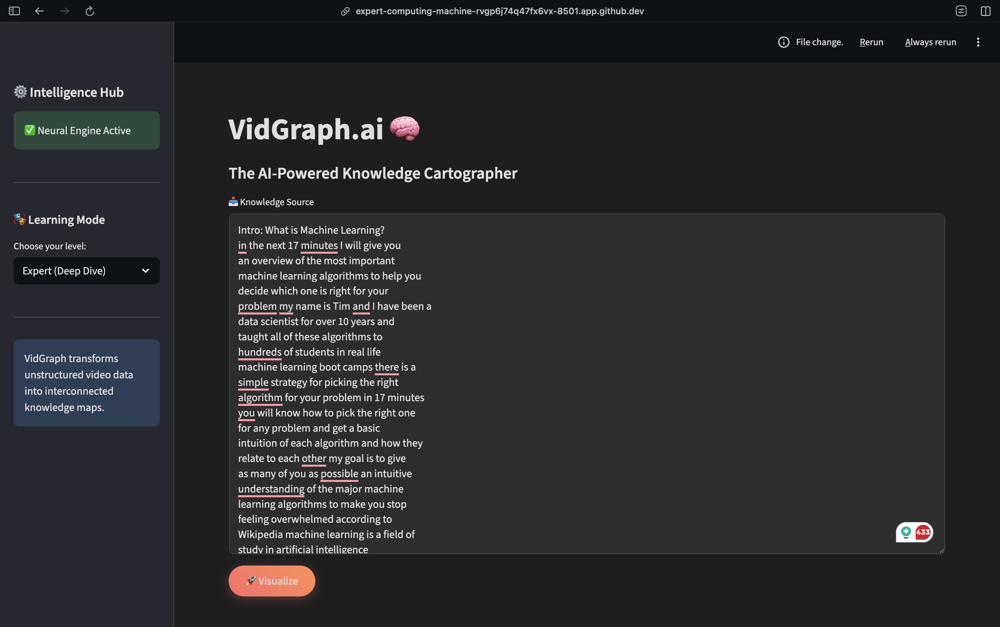
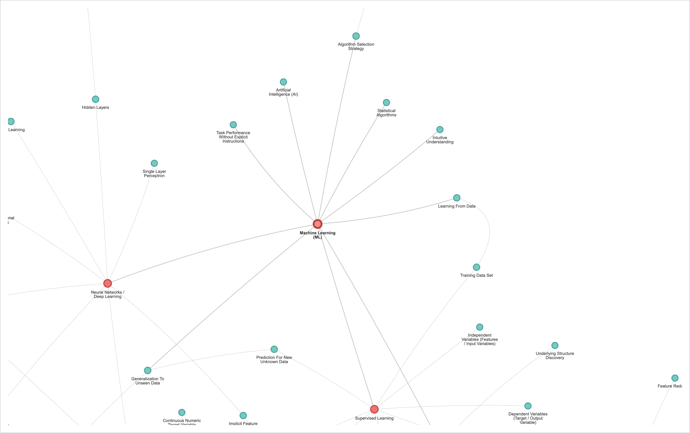
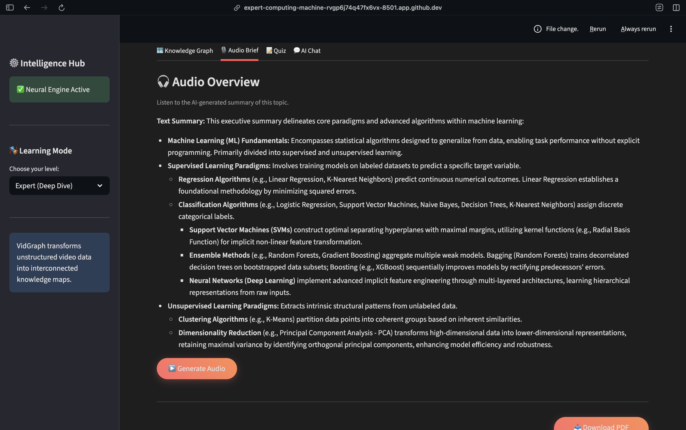
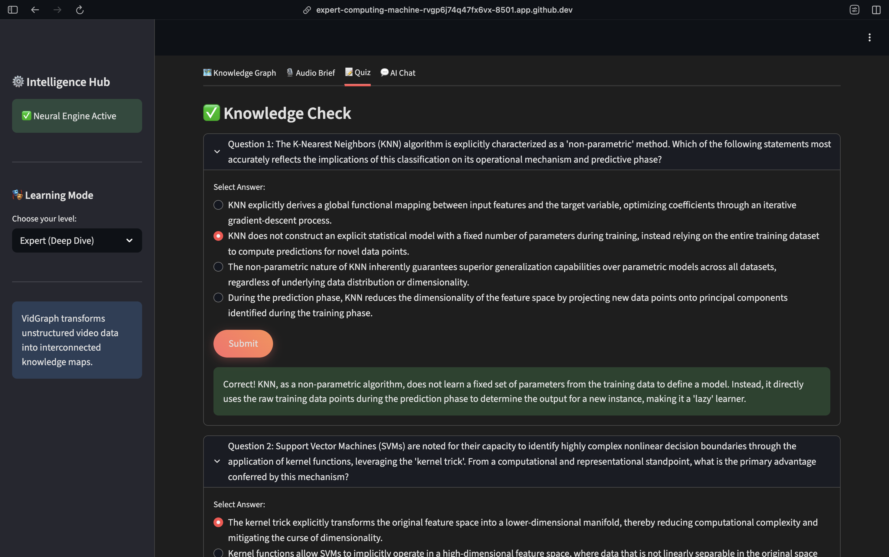
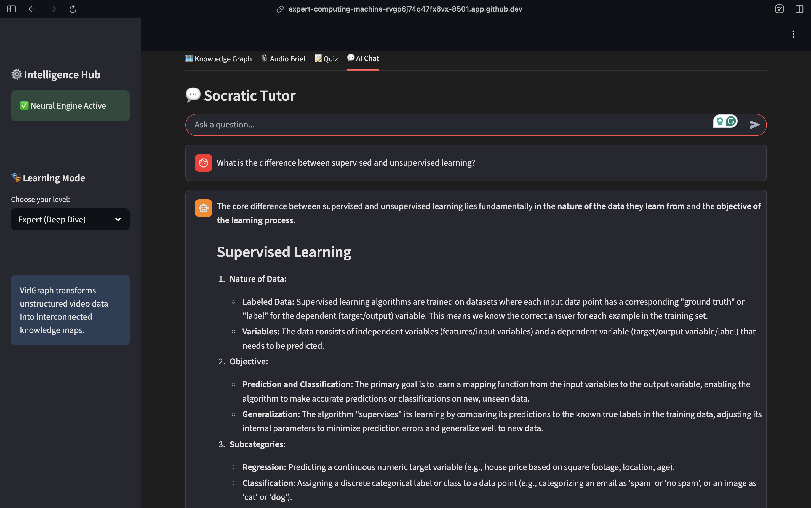
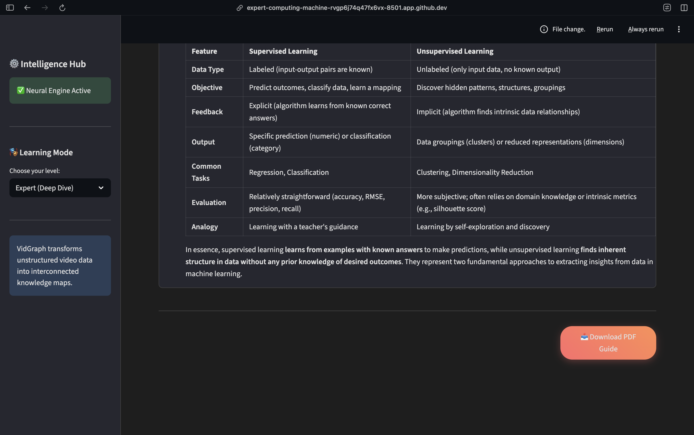

# VidGraph.ai 🧠

> **Transform Linear Video Content into Interactive Knowledge Networks.**

[](https://streamlit.io/)
[](https://deepmind.google/technologies/gemini/)
[](https://networkx.org/)
[](https://python.org/)

## 💡 The Problem

We consume hours of video content (lectures, tutorials, meetings), but our brains struggle to retain linear information. Traditional note-taking is passive, and students often miss the **hidden connections** between concepts.

## 🚀 The Solution

**VidGraph.ai** is an AI-powered study companion that transforms unstructured video transcripts into **Structured Knowledge Graphs**.
Instead of reading a wall of text, users explore a dynamic, physics-based network where concepts are mathematically weighted by importance.

---

## ✨ Key Technical Features

### 1. 🕸️ Graph-Based Knowledge Extraction

Unlike standard summarizers, VidGraph uses a **Graph-RAG approach**.

* **Entity Extraction:** Uses **Google Gemini 1.5 Pro** to identify "Core Concepts" and "Sub-concepts."
* **Relationship Mapping:** Forces the LLM to identify lateral connections between disparate topics, ensuring a dense, interconnected web rather than isolated clusters.

### 2. 🧮 PageRank Importance Algorithm

We don't just visualize data; we analyze it.

* **NetworkX Integration:** The system builds an in-memory graph structure and runs the **PageRank algorithm** on the generated nodes.
* **Visual Weighting:** Concepts with higher centrality scores are rendered physically larger, instantly showing the user what is most important to study.

### 3. 🤖 Context-Aware RAG Chatbot

* **Full-Context Injection:** Leverages Gemini's 1M+ token context window to inject the entire transcript into the system prompt.
* **Grounded Q&A:** The chatbot answers questions *strictly* based on the video content, reducing hallucinations and acting as a focused tutor.

### 4. 🎧 Multi-Modal Learning
* **Audio Summaries:** Uses **gTTS (Google Text-to-Speech)** to convert AI summaries into audio, making learning accessible on the go.
* **Automated Study Guides:** Generates a downloadable PDF containing the summary, graph concepts, and quiz using a custom FPDF engine.

### 5. 📄 Automated Study Guide Generation

* **FPDF Engine:** Dynamically compiles the AI-generated summary, the structured concept list, and a practice quiz into a downloadable PDF.
* **Latin-1 Encoding Fix:** Includes custom text sanitization to handle complex Unicode characters during PDF generation.

---

## 🛠️ Tech Stack

| Component | Technology | Purpose |
| :--- | :--- | :--- |
| **Frontend** | **Streamlit** | Interactive Web UI & State Management |
| **AI Engine** | **Google Gemini 1.5 Flash** | Concept Extraction, Quiz Generation, Summarization |
| **Graph Logic** | **NetworkX** | PageRank calculation & Graph Theory algorithms |
| **Visualization** | **PyVis** | Interactive, physics-based network rendering (JavaScript) |
| **Export** | **FPDF** | Programmatic PDF generation for study guides |

---

## 📂 Project Structure

```text
VidGraph/
├── .streamlit/
│   └── secrets.toml          # API Keys (Not committed)
├── src/
│   ├── assets/               # Images for README
│   ├── graph_builder.py      # PyVis & PageRank Logic
│   ├── llm_engine.py         # Gemini API & Prompt Engineering
│   └── pdf_generator.py      # PDF Creation Logic
├── app.py                    # Main Streamlit Application
├── requirements.txt          # Python Dependencies
├── .gitignore                # Git Exclusion Rules
└── README.md                 # Project Documentation

---

## 📸 Screenshots








## 📦 Installation

1. **Clone the repo**
   ```bash
   git clone [https://github.com/shivanic02/VidGraph.git](https://github.com/shivanic02/VidGraph.git)
   cd VidGraph

2. **Install dependencies**
   ```bash
   pip install -r requirements.txt

3. **Set up API Key** 
   Create a ```.streamlit/secrets.toml``` file:

   ```bash
   GOOGLE_API_KEY = "your_gemini_key_here"

4. **Run the App**
   ```bash
   streamlit run app.py

## 🏆 Hackathon Notes

Built for CodeCraze Hackathon 2025.

- Focus: EdTech / AI Visualization

- Innovation: Applying Graph Theory (PageRank) to LLM outputs for better educational prioritization.